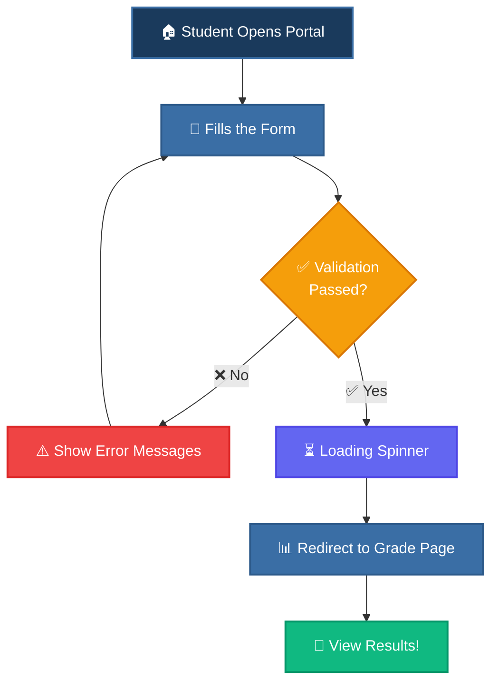

<div align="center">

<!-- Animated SVG Header Banner -->


<!-- Animated Typing SVG -->
<a href="https://git.io/typing-svg">
  
</a>

<br/>

<!-- Animated Badges -->
[](https://developer.mozilla.org/en-US/docs/Web/HTML)
[](https://developer.mozilla.org/en-US/docs/Web/CSS)
[](https://developer.mozilla.org/en-US/docs/Web/JavaScript)
[](LICENSE)
[](#)

<br/>

<!-- Animated Stars/Lines -->


</div>

<!-- ═══════════════════════════════════════════════════════════════ -->

##  &nbsp;About The Project

> **School Result Portal** is a clean, accessible web application designed for **Government High School** to provide students and parents with a secure way to access academic results for the **2025–2026** academic year. Students can look up their grades by entering their **Class**, **Division**, **Roll Number**, and **Date of Birth**.

<div align="center">

```
╔══════════════════════════════════════════════════════════════╗
║                                                              ║
║    🏫  G O V E R N M E N T   H I G H   S C H O O L  🏫     ║
║                                                              ║
║          📋 Student Result Access Portal 📋                  ║
║                                                              ║
║    ┌──────────────┐  ┌──────────────┐                        ║
║    │  Select Class │  │ Select Div.  │                        ║
║    └──────────────┘  └──────────────┘                        ║
║    ┌──────────────┐  ┌──────────────┐                        ║
║    │  Roll Number  │  │ Date of Birth│                        ║
║    └──────────────┘  └──────────────┘                        ║
║                                                              ║
║           ┌────────────────────────┐                         ║
║           │    🔍 View Result      │                         ║
║           └────────────────────────┘                         ║
║                                                              ║
╚══════════════════════════════════════════════════════════════╝
```

</div>

<!-- Wave Separator -->


##  &nbsp;Key Features

<div align="center">

|  | Feature | Description |
|:---:|:---|:---|
| 🎓 | **Class Selection** | Choose from Class 1 through Class 10 |
| 📚 | **Division Picker** | Select Division A, B, or C |
| 🔢 | **Roll Number Input** | Enter roll number (1–100) with validation |
| 📅 | **DOB Verification** | Date of birth for identity verification |
| ✅ | **Real-time Validation** | Instant error feedback on form fields |
| ⏳ | **Loading Animation** | Smooth spinner during result fetch |
| 📱 | **Fully Responsive** | Works on mobile, tablet & desktop |
| 🖨️ | **Print Optimized** | Clean print layout for result sheets |

</div>

<!-- Wave Separator -->


##  &nbsp;Tech Stack

<div align="center">

<table>
<tr>
<td align="center" width="120">

<br><strong>HTML5</strong>
<br><sub>Semantic Markup</sub>
</td>
<td align="center" width="120">

<br><strong>CSS3</strong>
<br><sub>Responsive Design</sub>
</td>
<td align="center" width="120">

<br><strong>JavaScript</strong>
<br><sub>Form Validation</sub>
</td>
<td align="center" width="120">

<br><strong>VS Code</strong>
<br><sub>IDE</sub>
</td>
</tr>
</table>

</div>

<!-- Wave Separator -->


##  &nbsp;Project Structure

```
📦 School-Result-Portal
 ┣ 📄 index.html        ← 🏠 Main portal page (student login form)
 ┣ 📄 grade.html         ← 📊 Result display page
 ┣ 📄 style.css          ← 🎨 Complete stylesheet (responsive + print)
 ┣ 📄 script.js          ← ⚙️ Form validation & submission logic
 ┗ 📄 README.md          ← 📖 You are here!
```

<!-- Wave Separator -->


##  &nbsp;Getting Started

### Prerequisites

All you need is a modern web browser! No build tools, no package managers, no frameworks required.

### Installation

```bash
# 1️⃣ Clone the repository
git clone https://github.com/your-username/school-result-portal.git

# 2️⃣ Navigate into the project
cd school-result-portal

# 3️⃣ Open in your browser
open index.html
# Or simply double-click index.html in your file explorer! 🚀
```

<!-- Wave Separator -->


##  &nbsp;How It Works

<div align="center">



</div>

<!-- Wave Separator -->


##  &nbsp;Form Validation Details

<div align="center">

| Field | Rule | Error Message |
|:---:|:---|:---|
| 📚 **Class** | Must select a class (1–10) | *"Please select a class."* |
| 🏷️ **Division** | Must select A, B, or C | *"Please select a division."* |
| 🔢 **Roll Number** | Required, between 1–100 | *"Roll number must be between 1 and 100."* |
| 📅 **Date of Birth** | Must be a valid date | *"Please select your date of birth."* |

</div>

> 💡 **Tip:** Errors are cleared automatically as soon as the user corrects the input field!

<!-- Wave Separator -->


##  &nbsp;Design Philosophy

<div align="center">

```
   ╭─────────────────────────────────────────╮
   │                                         │
   │   🎨  Clean & Minimal UI                │
   │   📱  Mobile-First Responsive           │
   │   ♿  Accessibility Focused              │
   │   🖨️  Print-Ready Layouts               │
   │   ⚡  Zero Dependencies                 │
   │   🔒  Client-Side Validation            │
   │                                         │
   ╰─────────────────────────────────────────╯
```

</div>

<!-- Wave Separator -->


##  &nbsp;Color Palette

<div align="center">

| Color | Hex | Usage |
|:---:|:---:|:---|
|  | `#1a3a5c` | Primary headings & branding |
|  | `#3a6ea5` | Buttons, links & accents |
|  | `#2d5a8a` | Button hover state |
|  | `#f5f7fa` | Background color |
|  | `#b91c1c` | Error states & required markers |
|  | `#4b5563` | Secondary text |

</div>

<!-- Wave Separator -->


## 🤝 Contributing

Contributions are always welcome! Here's how:

```
1. 🍴 Fork the repository
2. 🌿 Create a new branch  →  git checkout -b feature/amazing-feature
3. 💻 Make your changes
4. ✅ Commit your changes  →  git commit -m "Add amazing feature"
5. 🚀 Push to the branch   →  git push origin feature/amazing-feature
6. 📬 Open a Pull Request
```

</div>

<!-- Wave Separator -->


## 📬 Contact

<div align="center">

[](https://github.com/1sarthak7)
[](mailto:Sarthakbhopale1703@gmail.com)

</div>

<!-- Wave Separator -->


<div align="center">

### ⭐ Star this repo if you found it helpful! ⭐

<br/>

<!-- Animated Trophy -->


<br/><br/>

<!-- Animated Snake -->
<picture>
  <source media="(prefers-color-scheme: dark)" srcset="https://raw.githubusercontent.com/platane/snk/output/github-contribution-grid-snake-dark.svg" />
  <source media="(prefers-color-scheme: light)" srcset="https://raw.githubusercontent.com/platane/snk/output/github-contribution-grid-snake.svg" />
  
</picture>

<br/><br/>

<!-- Visitor Counter -->


<br/><br/>

<!-- Footer Wave -->


</div>

<!-- Made with ❤️ for Government High School -->
